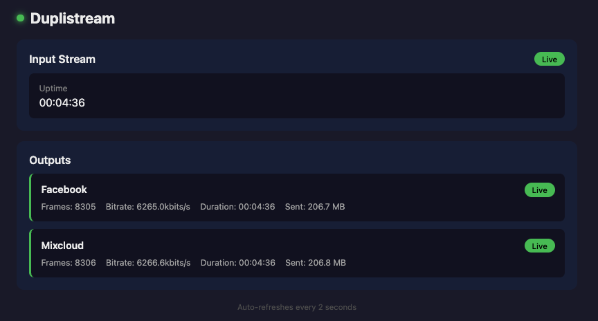

# Duplistream

A lightweight, self-hosted tool that duplicates your stream to multiple platforms simultaneously. Stream once from OBS, go live everywhere.

Built for DJs, musicians, and streamers who want to go live on multiple platforms without paying for cloud restreaming services.



## Features

- **Multi-platform streaming** - Stream to YouTube, Facebook, Twitch, Instagram, TikTok, Mixcloud, Mixlr, and any RTMP destination
- **Output isolation** - Each platform runs in its own process; one failing won't take down the others
- **Auto-reconnect** - Outputs automatically reconnect with exponential backoff if they drop
- **Live dashboard** - Web UI showing real-time status of all outputs
- **Hot reload** - Update config without restarting (add/remove outputs on the fly)
- **Stream key validation** - Optional security to reject unauthorized streams
- **Audio-only support** - Send audio-only streams to platforms like Mixlr

See [FEATURES.md](FEATURES.md) for detailed documentation.

## Quick Start

### Prerequisites

- FFmpeg installed and in PATH
- Go 1.21+ (only if building from source)

```bash
# macOS
brew install ffmpeg

# Ubuntu/Debian
sudo apt install ffmpeg

# Windows (chocolatey)
choco install ffmpeg

# Windows (manual)
# Download from https://ffmpeg.org/download.html and add to PATH
```

### Installation

**Download a pre-built binary** from the [Releases](https://github.com/yourusername/duplistream/releases) page, or build from source:

```bash
git clone https://github.com/yourusername/duplistream.git
cd duplistream
go build -o duplistream
```

#### Building for All Platforms

To build binaries for all supported platforms:

```bash
./build.sh v1.0.0
```

This creates binaries in the `dist/` directory:

```
dist/
├── duplistream-darwin-amd64      # macOS Intel
├── duplistream-darwin-arm64      # macOS Apple Silicon
├── duplistream-linux-amd64       # Linux x64
├── duplistream-linux-arm64       # Linux ARM64/Raspberry Pi
├── duplistream-windows-amd64.exe # Windows x64
└── duplistream-windows-arm64.exe # Windows ARM64
```

Check version with:

```bash
./duplistream -version
```

### Configuration

Copy the example config and add your stream keys:

```bash
cp config.yaml.example config.yaml
```

Edit `config.yaml`:

```yaml
server:
  listen: ":1935"
  app: "live"
  stream_key: ""  # Optional: require this key from OBS
  status_port: ":9090"

outputs:
  youtube:
    enabled: true
    url: "rtmp://a.rtmp.youtube.com/live2"
    key: "your-youtube-stream-key"
    audio_only: false
    audio_copy: true  # Pass through audio without re-encoding

  facebook:
    enabled: true
    url: "rtmps://live-api-s.facebook.com:443/rtmp/"
    key: "your-facebook-stream-key"
    audio_only: false
    audio_copy: true

  mixcloud:
    enabled: true
    url: "rtmp://rtmp.mixcloud.com/broadcast"
    key: "your-mixcloud-stream-key"
    audio_only: false
    audio_copy: true

  mixlr:
    enabled: true
    url: "rtmp://rtmp.mixlr.com/broadcast"
    key: "your-mixlr-stream-key"
    audio_only: true       # Audio-only platform
    audio_bitrate: "320k"  # Re-encode audio (required for audio_only)
```

You can also use environment variables:

```yaml
key: "${YOUTUBE_STREAM_KEY}"
```

### Run

```bash
./duplistream -config config.yaml
```

### OBS Setup

1. Open OBS Settings → Stream
2. Set **Service** to "Custom..."
3. Set **Server** to `rtmp://your-server-ip:1935/live`
4. Set **Stream Key** to anything (or the key from your config if you set one)
5. Click "Start Streaming"

### Encoder Settings (Important!)

Duplistream passes your video and audio through without re-encoding, so your streaming software must be configured correctly.

#### Recommended Settings

| Setting | Value | Notes |
|---------|-------|-------|
| **Resolution** | 1280x720 (720p) | Platforms downscale anyway; saves bandwidth |
| **Frame Rate** | 30 fps | Standard for streaming |
| **Video Bitrate** | 3500 kbps | Good balance of quality and stability |
| **Keyframe Interval** | 2 seconds | Required by most platforms |
| **Audio Bitrate** | 320 kbps | High quality audio for music/DJ streams |
| **Audio Sample Rate** | 48 kHz | Standard for streaming |
| **Encoder Preset** | "veryfast" or "faster" | For CPU encoding (x264) |

> **Why these settings?** Platforms like Facebook, YouTube, and Twitch expect 2-second keyframes and will show warnings or degrade quality otherwise. 720p at 3500kbps provides a solid, stable stream that works well across all platforms without overwhelming your upload bandwidth.

#### OBS Studio

**Video Settings** (Settings → Video):
1. Set **Base (Canvas) Resolution** to `1280x720`
2. Set **Output (Scaled) Resolution** to `1280x720`
3. Set **Common FPS Values** to `30`

**Output Settings** (Settings → Output → Advanced → Streaming):
1. Set **Output Mode** to "Advanced"
2. Set **Video Bitrate** to `3500` kbps
3. Set **Keyframe Interval** to `2` seconds
4. Set **Audio Bitrate** to `320`
5. If using x264, set **CPU Usage Preset** to "veryfast" or "faster"

#### Streamlabs Desktop

1. Go to **Settings → Video**
2. Set resolution to `1280x720` and FPS to `30`
3. Go to **Settings → Output** → "Advanced" mode
4. Under **Streaming**: Video Bitrate `3500`, Keyframe Interval `2`, Audio Bitrate `320`

#### XSplit Broadcaster

1. Go to **Settings → Output**
2. Click the gear icon next to your encoder
3. Set resolution to `1280x720`, 30fps
4. Set **Bitrate** to `3500` kbps
5. Set **Key Frame Interval** to `2` seconds

#### FFmpeg (direct)

```bash
ffmpeg -i <source> \
  -c:v libx264 -preset veryfast -b:v 3500k \
  -g 60 -keyint_min 60 \
  -s 1280x720 -r 30 \
  -c:a aac -b:a 320k -ar 48000 \
  -f flv rtmp://your-server:1935/live/key
```

#### Wirecast

1. Go to **Output Settings**
2. Set resolution to 1280x720, 30fps
3. Set **Bitrate** to `3500` kbps
4. Set **Key Frame Interval** to `2` seconds

#### vMix

1. Go to **Settings → Outputs**
2. Set resolution to 1280x720, 30fps
3. Set streaming bitrate to `3500` kbps
4. Set **Keyframe Frequency** to `2` seconds

### Dashboard

Open `http://localhost:9090` in your browser to see the live dashboard with real-time status of all outputs, including frames, bitrate, duration, and data sent. The dashboard auto-refreshes every 2 seconds.

## Usage

### Endpoints

| Endpoint | Description |
|----------|-------------|
| `GET /` | Web dashboard |
| `GET /status` | JSON status of all outputs |
| `GET /health` | Health check (healthy/degraded/down) |

### Hot Reload

Update `config.yaml` and reload without restarting:

```bash
kill -HUP $(pgrep duplistream)
```

### Running as a Service (systemd)

Create `/etc/systemd/system/duplistream.service`:

```ini
[Unit]
Description=Duplistream
After=network.target

[Service]
Type=simple
User=youruser
WorkingDirectory=/path/to/duplistream
ExecStart=/path/to/duplistream -config config.yaml
ExecReload=/bin/kill -HUP $MAINPID
Restart=always
RestartSec=5

[Install]
WantedBy=multi-user.target
```

```bash
sudo systemctl enable duplistream
sudo systemctl start duplistream

# Reload config
sudo systemctl reload duplistream
```

## Deployment Options

### Local (Your Laptop/Desktop)

The simplest setup - run Duplistream on the same machine as OBS.

**Pros:**
- Zero latency between OBS and Duplistream
- No additional infrastructure needed
- Easy to set up and debug

**Cons:**
- Your upload bandwidth must handle ALL outputs simultaneously
- If your internet drops, all streams die
- Laptop must stay awake and connected

**Best for:** Testing, small streams, or if you have excellent upload bandwidth (50+ Mbps).

### Dedicated Server (VPS/Cloud)

Run Duplistream on a cloud server (DigitalOcean, Linode, AWS, etc.) and stream from OBS to the server.

**Pros:**
- Server's upload bandwidth handles fan-out (typically 1+ Gbps)
- Your home connection only uploads one stream
- More reliable - server stays online even if your laptop sleeps
- Can be closer to platform ingest servers (lower latency)

**Cons:**
- Monthly server cost ($5-20/month for a small VPS)
- Slight added latency (usually negligible)
- More complex setup

**Best for:** Multi-platform streaming, unreliable home internet, or professional use.

**Recommended specs:** 1 CPU, 1GB RAM is plenty. Duplistream is lightweight - the bottleneck is bandwidth, not compute.

### Bandwidth Considerations

Duplistream fans out your stream to multiple platforms. Each output consumes the full stream bitrate.

**Bandwidth calculation:**
```
Upload needed = (video bitrate + audio bitrate) × number of outputs
```

**Example with recommended settings (3500kbps video + 320kbps audio):**

| Outputs | Upload Bandwidth Needed |
|---------|------------------------|
| 1 | ~4 Mbps |
| 2 | ~8 Mbps |
| 3 | ~12 Mbps |
| 4 | ~16 Mbps |
| 5 | ~20 Mbps |

**Tips:**
- Always have 20-30% headroom above your calculated need
- Test your upload speed at [speedtest.net](https://speedtest.net) before streaming
- If bandwidth is tight, reduce video bitrate (2500kbps still looks good at 720p)
- Consider a cloud server if your home upload is under 20 Mbps and you need 3+ outputs

## Platform Compatibility

| Platform | Status | Notes |
|----------|--------|-------|
| **Mixcloud** | Tested | Works flawlessly |
| **Facebook** | Tested | Works (may kill feed due to copyright detection) |
| **Instagram** | Tested | Works |
| **YouTube** | Untested | Should work - uses standard RTMP |
| **Twitch** | Untested | Should work - uses standard RTMP |
| **TikTok** | Untested | Should work - uses standard RTMP |
| **Mixlr** | Untested | Should work - audio-only platform |

## Platform-Specific Notes

### Facebook

After starting your stream, you must manually click "Go Live" in Facebook's Live Producer interface. Facebook holds streams in preview mode until you do this.

### YouTube

You may need to enable live streaming on your YouTube account first (can take 24 hours to activate).

### Twitch

Get your stream key from the Twitch Creator Dashboard under Settings → Stream. The key is persistent and doesn't change.

### Instagram

Instagram Live requires a Creator or Business account. Get your stream key from the Instagram app:
1. Open Instagram → Create Post → Live
2. Tap the streaming software icon
3. Copy the Stream URL and Stream Key

Note: Instagram stream keys expire after each session.

### TikTok

TikTok Live requires 1,000+ followers. Get your stream credentials from TikTok Live Studio or the TikTok app:
1. Open TikTok → Go Live → Cast/Connect
2. Copy the Server URL and Stream Key

Note: TikTok provides a unique server URL and key for each session - both must be updated before each stream.

### Mixcloud

Mixcloud accepts video streams and broadcasts live, but only records audio. No special config needed.

## Troubleshooting

**"Key frame rate too low" (Facebook/YouTube warning)**
Set your keyframe interval to 2 seconds in your streaming software. See [Encoder Settings](#encoder-settings-important) above.

**"no outputs configured"**
All outputs are either disabled or missing stream keys. Check your config.

**"executable file not found in $PATH"**
FFmpeg isn't installed. Install it with your package manager.

**One output keeps reconnecting**
Check that platform's stream key is correct. The dashboard will show the error message.

**OBS says "Failed to connect"**
- Verify duplistream is running
- Check you're using the correct port (default: 1935)
- If using `stream_key` in config, make sure OBS is using the same key

## License

Apache 2.0 - See [LICENSE](LICENSE) for details.

Attribution must be preserved for all contributors. See [NOTICE](NOTICE) for contributor list.

## Contributing

PRs welcome! Please open an issue first to discuss major changes.
